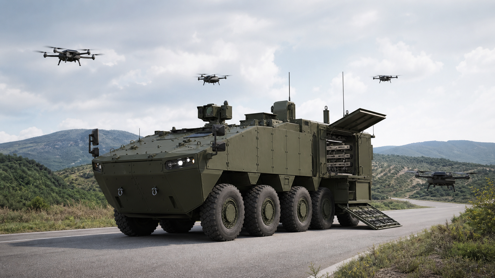
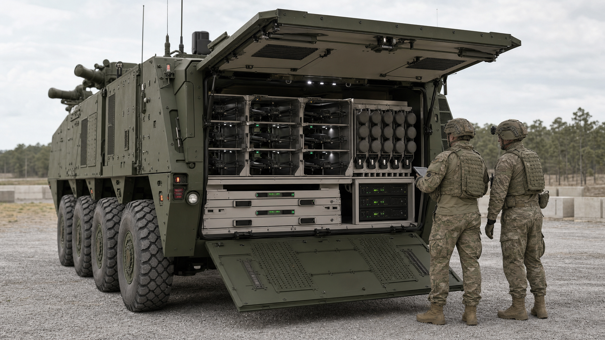
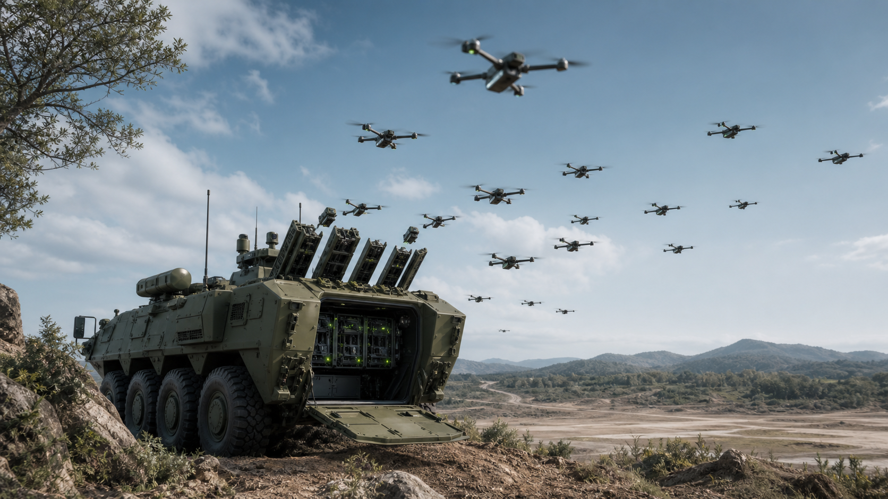

# 군집드론 탑재 차륜형장갑차 개발사업 기초자료

국기연 소요기획서 작성에 활용하기 위한 HTML 시각자료본과 HWP 붙여넣기용 서술형 초안입니다.

> 이 저장소는 공개 자료 확인용으로 정리되어 있으며, 특정 차종 적용 내용은 일반 차륜형장갑차 기반 표현으로 정리했습니다.

## 바로 열 파일

- [HTML 시각자료 보기](index.html)
- [작업용 HTML 원본](output/krit_swarm_drone_wheeled_apc_visual_report.html)
- [HWP 붙여넣기용 서술형 초안](output/krit_swarm_drone_wheeled_apc_research_draft.md)

GitHub Pages가 활성화되면 아래 주소에서 웹페이지 형태로 바로 볼 수 있습니다.

https://qkfhvnfrl-ux.github.io/new-project/

## 핵심 결론

본 사업은 단순 드론 탑재 차량이 아니라, 장갑기동부대와 함께 움직이는 저장·충전·발사·통제·데이터연동 플랫폼으로 기획해야 합니다.

러시아-우크라이나 전쟁 이후 FPV 드론, 자폭드론, 배회형 탄약, 군집드론이 대량 소모형 전력으로 확산되고 있습니다. 기존 차륜형장갑차는 다수 드론을 안전하게 저장하고 충전하며 자동 발사하고 임무를 통제하는 전용 구조가 부족합니다.

기존 차륜형장갑차의 후방 병력공간을 드론 저장고, 자동발사기, 충전장치, 데이터링크, AI 임무관리 서버로 전환하는 개조개발 방식이 현실적입니다. 신규 차체 개발보다 개발기간과 위험을 줄일 수 있고, 국내 지상군 전술체계와 보안요구에 맞춘 통합이 가능합니다.

## 포함 자료

| 구분 | 내용 |
|---|---|
| 해외 시장 분석 | 드론 전장화, FPV 드론, 자폭드론, 군집드론, MUM-T 확대 |
| 해외 경쟁체계 분석 | Stryker 기반 드론 플랫폼, Leonidas, PIRANHA 10×10, RCH155, Boxer Mission Module, Patria 6×6, VBTP Guarani, JLTV, Mission Master UGV |
| 개조개발 필요성 | 차륜형장갑차 기반 전방·중앙·후방 임무공간 배치 개념 |
| 예상 사업비 | 소형 240억 원, 중형 655억 원, 대형 1,270억 원 추정 |
| 과제카드 이미지 | 대표 컨셉 이미지 3장과 생성형 AI 프롬프트 |
| 참고문헌 | 정부기관, 국방기관, NATO, RAND, CSIS, 업체 공식자료 링크 |

## 시각자료 미리보기

### 후방 드론 컨테이너 개방 장면

### 군집드론 동시 발사 장면

## 사업비 추정

| 항목 | 소형 | 중형 | 대형 |
|---|---:|---:|---:|
| 체계설계 | 20억 | 40억 | 70억 |
| 임무컴퓨터 | 15억 | 35억 | 60억 |
| AI 소프트웨어 | 20억 | 60억 | 120억 |
| 데이터링크 | 20억 | 50억 | 100억 |
| 드론발사기 | 25억 | 70억 | 140억 |
| 차량개조 | 30억 | 80억 | 150억 |
| 시제제작 | 60억 | 180억 | 350억 |
| 시험평가 | 30억 | 80억 | 160억 |
| 군 운용시험 | 20억 | 60억 | 120억 |
| 합계 | 240억 | 655억 | 1,270억 |

## 주요 참고 링크

- DARPA OFFSET: https://www.darpa.mil/program/offensive-swarm-enabled-tactics
- NATO DIANA: https://www.diana.nato.int/
- Epirus Leonidas: https://www.epirusinc.com/
- ARTEC Boxer: https://www.artec-boxer.com/
- KNDS RCH155: https://knds.com/en/products/systems/rch-155/
- AeroVironment: https://www.avinc.com/
- 방위사업청: https://www.dapa.go.kr/
- 국방기술진흥연구소: https://www.krit.re.kr/
- 국방기술품질원: https://www.dtaq.re.kr/

## 주의

사업비와 미공개 제원은 공개자료 기반 기획단계 추정입니다. 실제 소요기획서 반영 전에는 국방부, 방위사업청, 국방기술진흥연구소, 국방기술품질원, 업체 제공자료로 최종 검증이 필요합니다.

